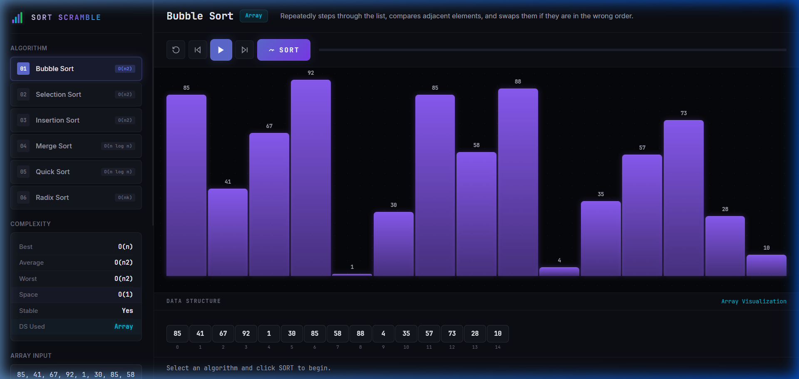

# SORT SCRAMBLE

An interactive sorting algorithm visualizer built with Flask and vanilla JavaScript. Watch sorting algorithms come to life with step-by-step animations, real-time comparisons, and data structure visualizations.

## Screenshots

### Home Page


### Bubble Sort in Action


### Merge Sort Visualization


## Features

- **6 Sorting Algorithms** — Bubble Sort, Selection Sort, Insertion Sort, Merge Sort, Quick Sort, Radix Sort
- **Step-by-Step Animation** — Play, pause, step forward, step backward through each operation
- **Live Bar Chart** — Bars change color during comparisons (orange), swaps (yellow), and sorted state (green)
- **Complexity Dashboard** — Displays Best, Average, Worst time complexity, space complexity, stability, and data structure used
- **Data Structure Panel** — Shows the array state with highlighted indices during each step
- **Custom Array Input** — Enter your own numbers or use the randomly generated array
- **Speed Control** — Adjust animation speed with the progress slider

## Tech Stack

| Layer     | Technology        |
|-----------|-------------------|
| Backend   | Python, Flask     |
| Frontend  | HTML, CSS, JS     |
| Styling   | Vanilla CSS (dark cyberpunk theme) |

## Project Structure

```
SORT-SCRAMBLED-NUMBER/
├── app.py                  # Flask server with API endpoints
├── algorithms/
│   ├── __init__.py         # Algorithm registry and metadata
│   ├── bubble_sort.py      # Bubble Sort step generator
│   ├── selection_sort.py   # Selection Sort step generator
│   ├── insertion_sort.py   # Insertion Sort step generator
│   ├── merge_sort.py       # Merge Sort step generator
│   ├── quick_sort.py       # Quick Sort step generator
│   └── radix_sort.py       # Radix Sort step generator
├── static/
│   ├── css/main.css        # All styles (dark theme, animations)
│   └── js/
│       ├── app.js          # Entry point, API calls
│       ├── animator.js     # Step playback and celebrations
│       ├── controls.js     # UI event handlers
│       └── renderer.js     # Bar chart and data structure rendering
├── templates/
│   └── index.html          # Single-page HTML template
├── test_algorithms.py      # Algorithm correctness tests
└── screenshots/            # Visual documentation
```

## Algorithms Supported

| Algorithm      | Best     | Average     | Worst       | Space | Stable |
|---------------|----------|-------------|-------------|-------|--------|
| Bubble Sort    | O(n)     | O(n²)       | O(n²)       | O(1)  | Yes    |
| Selection Sort | O(n²)    | O(n²)       | O(n²)       | O(1)  | No     |
| Insertion Sort | O(n)     | O(n²)       | O(n²)       | O(1)  | Yes    |
| Merge Sort     | O(n log n)| O(n log n) | O(n log n)  | O(n)  | Yes    |
| Quick Sort     | O(n log n)| O(n log n) | O(n²)       | O(log n)| No   |
| Radix Sort     | O(nk)    | O(nk)       | O(nk)       | O(n+k)| Yes    |

## How to Run

```bash
pip install flask
python app.py
```

Then open `http://127.0.0.1:5000` in your browser.

## Running Tests

```bash
python test_algorithms.py
```

All 36 test cases verify each algorithm across 6 input types: random, sorted, reverse, single element, duplicates, and two elements.