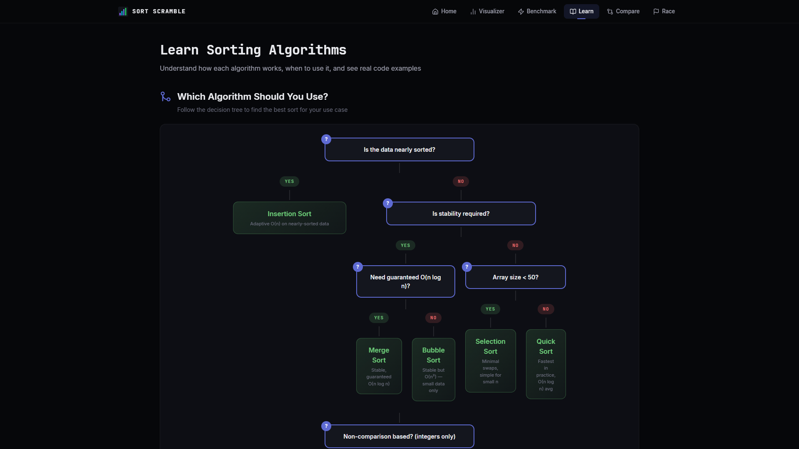
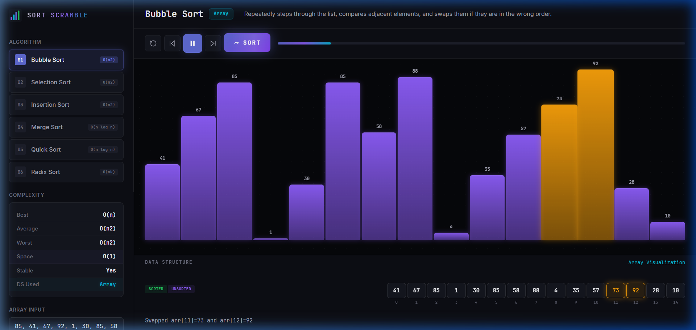
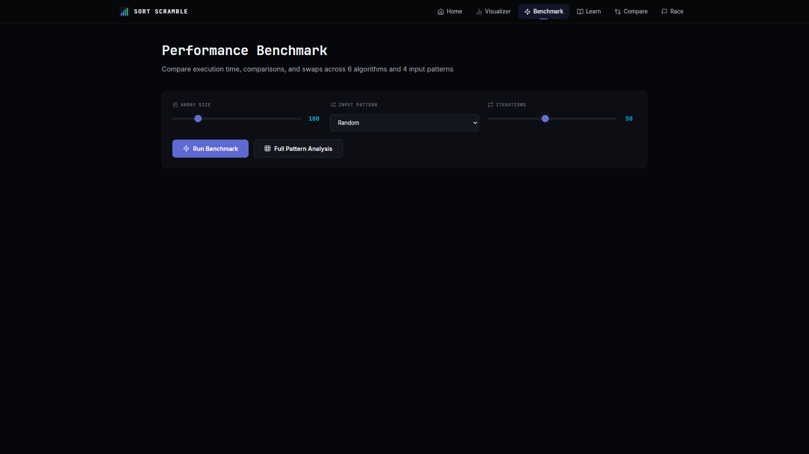
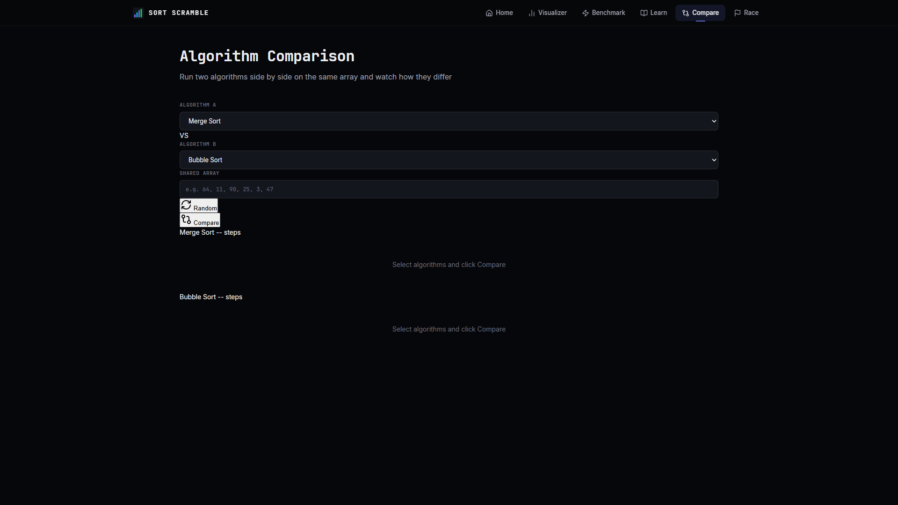
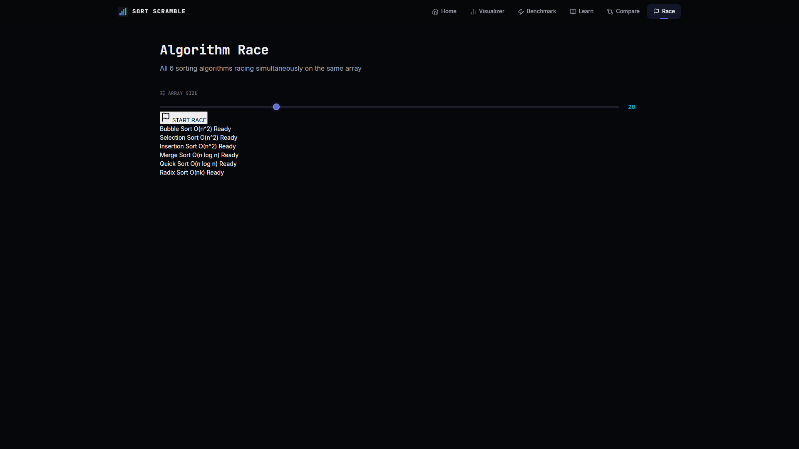
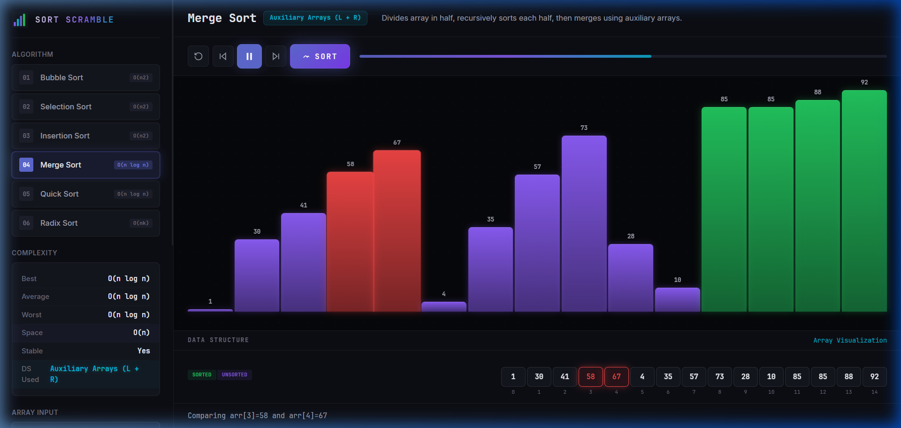

<div align="center">

# 📊 Sort Scramble

**An elite, high-performance algorithmic visualizer built for computer science education and analysis.**

[](https://python.org)
[](https://flask.palletsprojects.com/)
[](https://developer.mozilla.org/en-US/docs/Web/JavaScript)
[](https://opensource.org/licenses/MIT)

[Features](#features) • [Installation](#installation) • [Usage](#usage) • [Algorithms](#algorithms) • [Architecture](#architecture) • [Contributing](#contributing)

</div>

---

## 🚀 Overview

Sort Scramble is an interactive sorting algorithm visualizer built with Flask and vanilla JavaScript. Designed to bring sorting algorithms to life through step-by-step animations, real-time analytics, and side-by-side execution benchmarks.

## 📸 Core Dashboards

| Landing Page | Interactive Learning |
|:---:|:---:|
 |  |
| **Visualizer Dashboard** | **Algorithm Benchmark** |
|  |  | 
| **Algorithm Comparison** | **Algorithm Race Mode** |
|  |  |

> *Fully featured visualizations including state transitions for complex divide-and-conquer logic.*
> 

---

## ✨ Features

- **🎓 Educational Visualizer**: Step through 6 sorting algorithms with color-coded operations, pseudocode highlighting, and exact data structure tracing.
- **⚡ Performance Benchmarking**: Evaluate raw execution speed across varying input profiles (Sorted, Reversed, Nearly Sorted, Random).
- **🛤️ Algorithm Deep Dives**: Interactive decision trees, rigorous Big-O analysis boards, and real-world analogy breakdowns.
- **🏁 Global Race Mode**: Execute all 6 algorithms simultaneously via asynchronous process emulation.
- **📊 Granular Analytics**: Time/Space complexity telemetry, algorithmic stability reports, and comparative node swap counting.

## 🛠 Tech Stack

- **Backend**: Python 3, Flask (REST API, Telemetry)
- **Frontend**: ES6 JavaScript, HTML5 Canvas/DOM Rendering, Pure CSS3 (Cyberpunk UI)
- **Deployment & Analytics**: Vercel Speed Insights Integration

---

## 💻 Installation

### Prerequisites
- Python 3.9+ installed and accessible via `PATH`
- `pip` or `pip3` dependency manager
- Node.js (Optional, for Vercel analytics dependencies)

### Local Development Setup

1. **Clone the repository:**
   ```bash
   git clone https://github.com/your-org/sort-scramble.git
   cd sort-scramble
   ```

2. **Establish a Virtual Environment (Recommended):**
   ```bash
   python -m venv venv
   source venv/bin/activate  # On Windows: venv\Scripts\activate
   ```

3. **Install Core Dependencies:**
   ```bash
   pip install -r requirements.txt
   npm install  # (For optional frontend telemetry modules)
   ```

4. **Initialize the Server:**
   ```bash
   python app.py
   ```

5. **Access the Application:**  
   Navigate to `http://127.0.0.1:5000` via a modern web browser.

---

## 🧪 Testing

To execute algorithmic correctness protocol across all edge case arrays:

```bash
python -m unittest test_algorithms.py -v
```
All algorithms are systematically validated against permutations including: duplicates, inversions, and massive outliers.

---

## 🧬 Supported Algorithms

| Algorithm      | Best Time | Avg Time | Worst Time | Space | Stable |
|----------------|-----------|----------|------------|-------|--------|
| **Bubble**     | `O(n)`    | `O(n²)`  | `O(n²)`    | `O(1)`| Yes    |
| **Selection**  | `O(n²)`   | `O(n²)`  | `O(n²)`    | `O(1)`| No     |
| **Insertion**  | `O(n)`    | `O(n²)`  | `O(n²)`    | `O(1)`| Yes    |
| **Merge**      | `O(n log n)`| `O(n log n)` | `O(n log n)`| `O(n)`| Yes    |
| **Quick**      | `O(n log n)`| `O(n log n)` | `O(n²)`   | `O(log n)`| No   |
| **Radix**      | `O(nk)`   | `O(nk)`  | `O(nk)`    | `O(n+k)`| Yes  |

---

## 🏗 System Architecture

The project strictly segregates algorithm generation logic from API delivery and frontend rendering:

```text
algorithms/
 ├── bubble_sort.py       # Deterministic step generators representing states
 ├── merge_sort.py        # Recursive state capturing
 └── ...                  

app.py                    # Flask API providing pre-calculated JSON step sets
static/js/
 ├── animator.js          # Async step consumer for frame rendering
 ├── renderer.js          # DOM manipulation and CSS transitions
 └── ...
```

---

## 🤝 Contributing

We enforce a highly structured git flow.

1. Fork the Project.
2. Formulate your Feature Branch (`git checkout -b feature/AmazingAlgorithm`).
3. Commit Changes with strict conventional commits (`git commit -m 'feat: Add ShellSort algorithm'`).
4. Push to the Branch (`git push origin feature/AmazingAlgorithm`).
5. Open a Pull Request.

**Note:** The `master` / `main` branch is continually protected.

---

> Designed & Engineered for the DSA Hackathon 2026.
